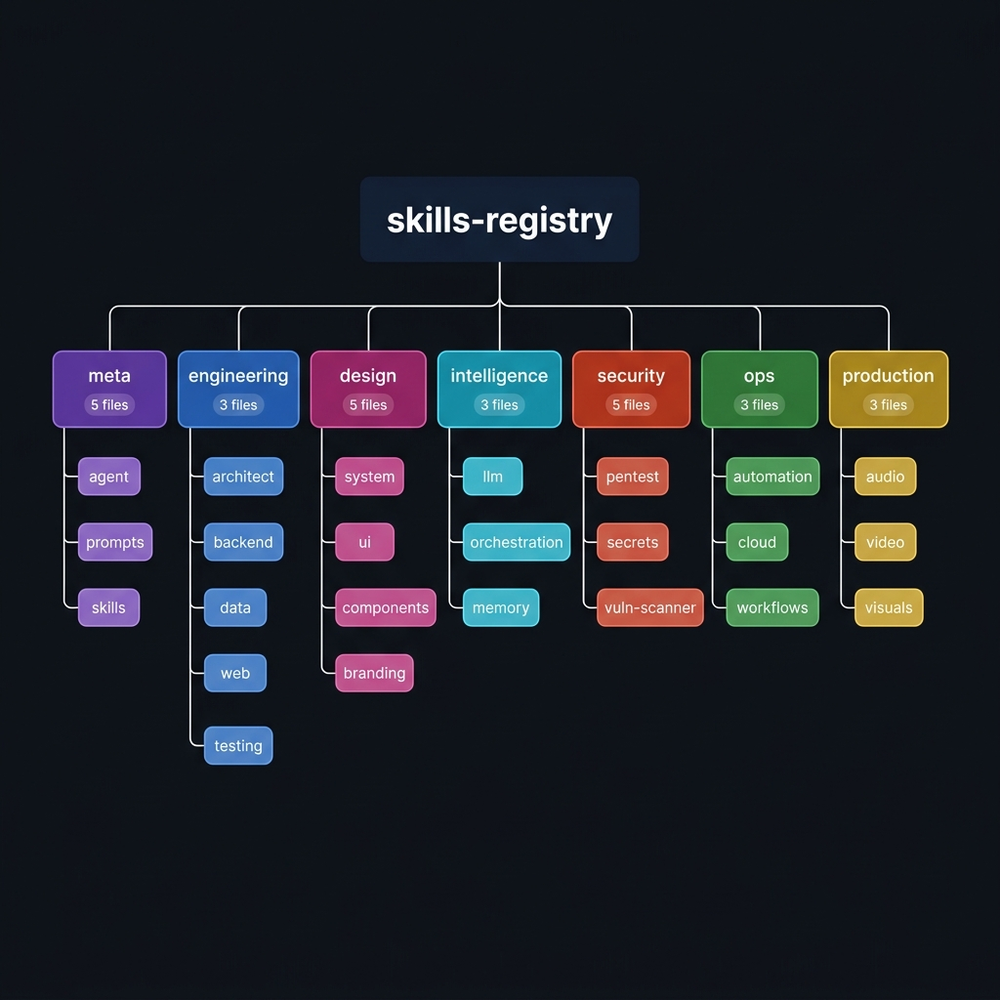

# 🧠 Skills Registry

> **4,173 industrial-grade AI skills** — fully audited, structured at 100/100 density, and ready for production agentic workflows.

This registry is the cognitive backbone of the **Jack / Master-AG** agentic engine. Every skill is a deterministic SOP (Standard Operating Procedure) that tells the AI agent *exactly* how to execute a task — no hallucination, no ambiguity.

---

## 🗺️ Registry Architecture



```
skills-registry/
├── meta/            ·  118 files  ·  Agent cognition & self-management
├── engineering/     · 2883 files  ·  Full-stack software development
├── design/          ·  486 files  ·  UI/UX, systems & visual design
├── intelligence/    ·  188 files  ·  LLM ops, AI orchestration & memory
├── ops/             ·  269 files  ·  Automation, cloud & workflows
├── production/      ·   70 files  ·  Audio, video & visual production
└── security/        ·  159 files  ·  Pentesting, secrets & vulnerability mgmt
```

---

## 📊 Global Audit Scorecard

| Sector | Files | Score | Failures |
|---|---|---|---|
| 🟣 `meta` | 118 | **100.0 / 100** | 0 |
| 🔵 `engineering` | 2,883 | **99.92 / 100** | 0 |
| 🩷 `design` | 486 | **99.85 / 100** | 0 |
| 🩵 `intelligence` | 188 | **100.0 / 100** | 0 |
| 🔴 `security` | 159 | **99.91 / 100** | 0 |
| 🟢 `ops` | 269 | **99.61 / 100** | 0 |
| 🟡 `production` | 70 | **100.0 / 100** | 0 |
| **TOTAL** | **4,173** | **~99.90 / 100** | **0** |

---

## 🟣 `meta` — Agent Cognition & Self-Management

The meta sector controls how the AI agent *thinks about itself*. These skills define behavioral modes, self-improvement cycles, skill creation protocols, and prompt engineering patterns.

### Sub-sectors

| Sub-sector | Coverage |
|---|---|
| `agent/` | Behavioral modes (brainstorm, implement, debug, review, ship), task scheduling, plan-execute-critic loops |
| `prompts/` | Prompt engineering, few-shot learning, chain-of-thought, system prompt design, output format tuning |
| `skills/` | Skill authoring standards, evaluation frameworks, A/B testing, staged rollout, rollback procedures |
| `misc/` | MCP integration, supervisor orchestration, stateful persistence, crash recovery |

**Use when:** You want the agent to change how it reasons, improve its own instructions, or manage its cognitive workflow.

---

## 🔵 `engineering` — Full-Stack Software Development

The largest sector. Covers the entire software development lifecycle from architecture through deployment, across web, mobile, backend, data, and testing.

### Sub-sectors

| Sub-sector | Coverage |
|---|---|
| `architect/` | System design, microservices, event-driven architecture, API design, database schema |
| `backend/` | Node.js, Python, REST APIs, GraphQL, authentication, caching, rate limiting, queues |
| `web/` | React, Next.js, TypeScript, state management (Redux, Zustand, Jotai), performance optimization, SSR |
| `data/` | ClickHouse, Kafka, ETL pipelines, data modeling, analytics queries, streaming inserts |
| `testing/` | TDD, unit tests, integration tests, E2E, LLM evaluation, behavioral contract testing |
| `misc/` | 600+ specialized patterns: React Native, monorepos, i18n, game dev, Docker, CI/CD, full-stack scaffolding |

**Use when:** You're building, debugging, refactoring, or auditing any software system.

---

## 🩷 `design` — UI/UX, Systems & Visual Design

Everything needed to create premium, accessible, and consistent user interfaces — from token-level design systems to component libraries and visual testing.

### Sub-sectors

| Sub-sector | Coverage |
|---|---|
| `system/` | Design tokens, color architecture (OKLCH), typography, spacing, dark mode, Tailwind v4 |
| `ui/` | Loading states, error states, empty states, skeleton vs spinner, button states, forms |
| `components/` | Compound components, Remotion video, Slack Block Kit, Stitch component patterns |
| `branding/` | Logo systems, brand voice, visual identity, documentation site structure |
| `accessibility/` | WCAG compliance, keyboard navigation, screen reader patterns, contrast checking |
| `stitch/` | Figma code connect, plugin API, WWDS variable/component patterns |
| `misc/` | Telegram bot UI, quiz/generator UX, viral content design, artifact bundling |

**Use when:** You're designing interfaces, building component libraries, or enforcing design consistency.

---

## 🩵 `intelligence` — LLM Ops, AI Orchestration & Memory

Covers everything about building and operating AI-powered systems — from raw LLM usage patterns to multi-agent orchestration and memory management.

### Sub-sectors

| Sub-sector | Coverage |
|---|---|
| `llm/` | Model selection, token economics, cost management, structured output, streaming, prompt versioning |
| `orchestration/` | Multi-agent coordination, conflict matrix, handoff schemas, parallel workflows, observability |
| `memory/` | Context compression, stateful agents, long-term memory patterns, context window management |
| `misc/` | AI product architecture, thin wrapper anti-patterns, code quality standards, D3.js visualizations, React patterns |

**Use when:** You're building AI products, optimizing LLM costs, or architecting multi-agent systems.

---

## 🔴 `security` — Pentesting, Secrets & Vulnerability Management

Offensive and defensive security SOPs for identifying, exploiting, and remediating vulnerabilities across web, network, and cloud environments.

### Sub-sectors

| Sub-sector | Coverage |
|---|---|
| `active-directory-attacks/` | Pass-the-hash, Kerberoasting, BloodHound recon, Golden/Silver Ticket, ZeroLogon |
| `xss-html-injection/` | Stored/reflected/DOM XSS, CSP bypass, cookie theft, filter bypass techniques |
| `html-injection-testing/` | Phishing payloads, defacement, bypass techniques, automated testing |
| `metasploit-framework/` | Module types, payload generation (msfvenom), Meterpreter, post-exploitation |
| `privilege-escalation-methods/` | Linux/Windows privesc, token impersonation, service exploitation |
| `windows-privilege-escalation/` | AlwaysInstallElevated, JuicyPotato, unquoted paths, credential harvesting |
| `shodan-reconnaissance/` | Host discovery, filter combinations, on-demand scanning, Python automation |
| `secrets-management/` | HashiCorp Vault, AWS/Azure/GCP secrets, CI/CD scanning, pre-commit hooks |
| `security-review/` | Code review checklists, vulnerability categorization, report templates |
| `attack-tree-construction/` | Threat modeling, attack surface mapping |

**Use when:** You're conducting security assessments, hardening infrastructure, or managing secrets.

---

## 🟢 `ops` — Automation, Cloud & Workflows

Operational intelligence covering infrastructure, automation pipelines, agentic workflow orchestration, and business process execution.

### Sub-sectors

| Sub-sector | Coverage |
|---|---|
| `automation/` | CI/CD, static analysis (Semgrep, SonarQube, CodeQL), pre-commit hooks, compliance scanning |
| `cloud/` | mTLS, certificate hierarchy, Istio, Linkerd, SPIFFE/SPIRE, cert-manager |
| `workflows/` | Temporal.io patterns (saga, fan-out/fan-in, entity workflows), durable execution, retry policies |
| `env/` | Environment setup, dotenv patterns, secrets injection |
| `misc/` | PRD writing, plan-document review, request refactoring, API conventions, planning workflows |

**Use when:** You're automating deployments, designing resilient workflows, or managing cloud infrastructure.

---

## 🟡 `production` — Audio, Video & Visual Production

End-to-end production pipelines for creating, editing, and publishing multimedia content using AI-assisted workflows.

### Sub-sectors

| Sub-sector | Coverage |
|---|---|
| `audio/` | Voice AI pipelines (Deepgram STT + ElevenLabs TTS), OpenAI Realtime API, VAPI, VAD, latency budgets |
| `video/` | YouTube scripting, Remotion video composition, narration workflows |
| `visuals/` | Figma code connect, visual artifact generation, screenshot testing |

**Use when:** You're building voice agents, generating video content, or producing visual assets programmatically.

---

## 📁 Skill File Structure

Every skill in this registry follows the **100/100 industrial standard**:

```markdown
---
name: skill-name
description: Use when executing [protocol] within the [sector] sector.
---

# Skill Title: Execution Protocol

## ⚙️ Overview
150+ character operational profile describing the exact behavior, 
performance guarantees, and system context for this skill.

## 🛠️ Implementation SOP
- **Step 1: Baseline Context** — verify environment (Node, Python, TS CLI)
- **Step 2: Apply the Pattern** — implement core logic
- **Step 3: Enforce Constraints** — syntax, security, O(1) compliance
- **Step 4: Execute Test Suite** — npm run test / pytest
- **Step 5: Document and Commit** — update walkthrough, sync telemetry

## 📚 Reference Material
[Original technical content preserved verbatim]
```

---

## 🔧 Usage

Skills are loaded automatically by the **Jack** agentic engine via the `~/.gemini/skills/` directory. The engine scans for applicable skills at the start of every task using its **Routing Engine**.

To audit the registry:
```bash
python execution/skill_audit.py
```

To mass-upgrade any sector:
```bash
python execution/mass_upgrade.py --sector <sector-name>
```

To verify zero data loss after an upgrade:
```bash
python execution/verify_knowledge_retention.py --sector <sector-name>
```

---

## 📈 Registry Stats

- **Total Skills:** 4,173
- **Global Pass Rate:** 100% (4,173 / 4,173)
- **Global Average Score:** ~99.90 / 100
- **Sectors:** 7
- **Knowledge Preserved:** ~8.7 MB of technical reference data
- **Standard:** 2026 Industrial-Grade Agentic SOP

---

*Built with [Master-AG](https://github.com/ShasanJain/Master_AG) · Powered by Jack (Antigravity IDE)*
