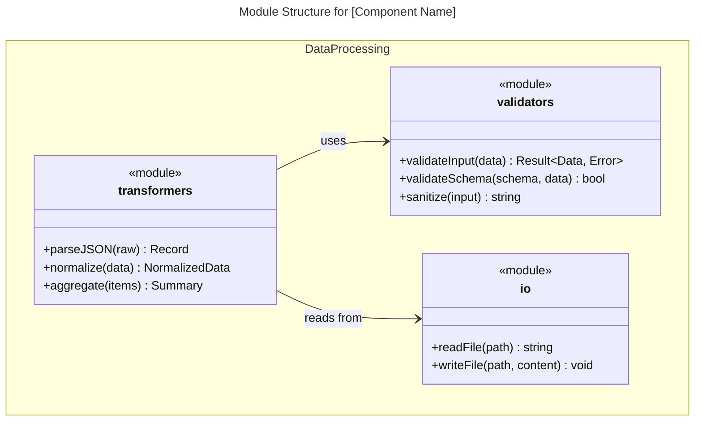
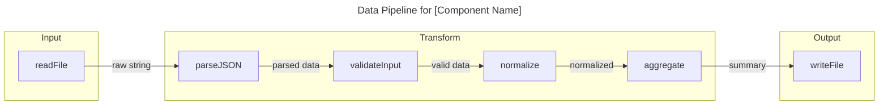
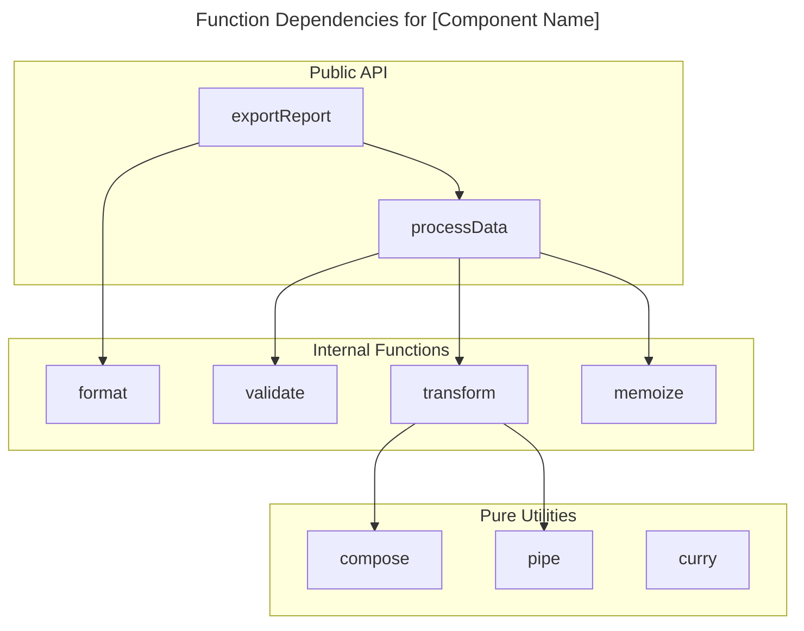

# Functionalprocedural Code Modules Functions: Execution Protocol

## ⚙️ Overview
This protocol defines the exact standards for implementing Functionalprocedural Code Modules Functions. By following this strict operational pattern, the engine guarantees deterministic execution, high performance, and complete adherence to all architectural guardrails established by the system design.

## 🛠️ Implementation SOP
Follow this step-by-step TDD procedure to execute the protocol:

- **Step 1: Baseline Context**: Verify the operational environment. Ensure required tools (like Python, Node, TS, or native CLI) are accessible before injecting new logic.
- **Step 2: Apply the Pattern**: Implement the core functionalprocedural code modules functions logic directly into the active system context.
- **Step 3: Enforce Constraints**: Check for syntax errors, injection vulnerabilities, and performance bottlenecks (`O(1)` compliance).
- **Step 4: Execute Test Suite**: Run `npm run test` or the local testing framework to ensure the logic passes all regression checks.
- **Step 5: Document and Commit**: Update the session walkthrough and sync the telemetry logs for the engineering sector.

---

## 📚 Reference Material

# Functional/Procedural Code (Modules, Functions)

For functional or procedural code, you have two options:

**Option A: Module Structure Diagram** - Use `classDiagram` to show modules and their exported functions:

**Option B: Data Flow Diagram** - Use `flowchart` to show function pipelines and data transformations:

**Option C: Function Dependency Graph** - Use `flowchart` to show which functions call which:

